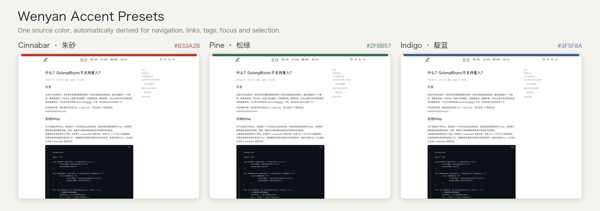

# Hexo Theme Wenyan

[🇬🇧 English](README.md)

`Wenyan` 是一个偏排版、偏阅读体验的极简 Hexo 博客主题。

**在线 Demo：** [fchange.github.io](https://fchange.github.io/)



## 为什么是 Wenyan

Wenyan 希望页面保持安静，让排版本身承担阅读体验。它把紧凑的编辑式首页、专注的长文布局、克制的微动画和 Hexo 原生内容能力组合在一起，同时不引入额外的前端构建步骤。

视觉层级参考 [`guangzhengli/nextjs-blog-template`](https://github.com/guangzhengli/nextjs-blog-template)，主题配置和内容模型则继续遵循 Hexo 的使用习惯。

## 安装

Wenyan 面向 Hexo 6 及以上版本，使用 EJS、原生 CSS 和原生 JavaScript。

1. 把主题拉到你的 Hexo 项目里：

```bash
git clone https://github.com/fchange/hexo-theme-wenyan.git themes/wenyan
```

2. 修改 Hexo 根目录 `_config.yml`：

```yml
theme: wenyan
```

3. 按需合并 `themes/wenyan/_config.yml` 里的主题配置。

## 快速开始

安装主题后，在 Hexo 项目中本地预览：

```bash
hexo clean
hexo server
```

然后打开 Hexo 输出的本地预览地址，通常是 `http://localhost:4000`。

如果文章页需要目录，可以在文章 front matter 中开启 `toc: true`：

```yml
---
title: 我的文章
date: 2026-01-01
toc: true
---
```

## 配置

主题主要配置都在 [`_config.yml`](_config.yml)。

通常需要优先修改：

- `logo`
- `accent`
- `navigation`
- `navigation_items`
- `social`
- `social_items`
- `home`
- `labels`
- `footer_info`
- `footer`
- `sketch`
- `motion`
- `search`
- `stats`
- `valine`

`navigation_items` 和 `social_items` 是可选的有序列表写法。配置后会优先于 `navigation` 和 `social`：

```yml
navigation_items:
  - label: 文章
    link: /
  - label: 归档
    link: /archives/
```

可以选择三套编辑风格预设之一，也可以只提供一个带引号的六位 Hex 色值。Wenyan 会自动派生强调色、灰调色、浅背景色和文本选区色：

```yml
accent:
  preset: cinnabar # cinnabar | pine | indigo
  color: ""        # 例如 "#c24132"，设置后优先于 preset
```

主题色只用于导航当前态、链接下划线与 Hover、目录当前章节、标签、外链标记、输入框 Focus、文本选区、复制成功状态和搜索高亮。

搜索使用 Google 站内搜索，不需要生成本地索引；不蒜子阅读统计同样是可选能力，两者默认关闭：

```yml
search:
  enabled: true

stats:
  busuanzi: true
  endpoint: https://busuanzi.ibruce.info/busuanzi
```

内联图标默认启用手绘风格，由 SVG 湍流 + 位移滤镜实时渲染——不修改任何图标资源，站点 Logo 保持锐利。可以调整抖动参数或整体关闭：

```yml
sketch:
  enable: true           # 设为 false 恢复精确几何图标
  base_frequency: 0.062  # 噪声密度——越大抖动越细密
  scale: 6               # 位移力度——越大线条越粗粝
  animate: false         # 循环噪声种子，产生"沸腾"手绘动画
```

文章页 Header 会复刻上游模板，从 `48rem` 平滑扩展至 `72rem`：

```yml
motion:
  header_expand: true
  duration: 500
```

Footer 可以关闭，也可以配置说明文字和链接：

```yml
footer:
  enabled: true
  text: © Your Name
  description: Writing, design, and technology.
  links:
    GitHub: https://github.com/yourname
    RSS: /atom.xml
```

## 特性

- **编辑式阅读：** 紧凑推荐文章首页、窄栏长文、桌面固定目录和按年份分组的语义化归档
- **个性化：** 明暗主题、三套主题色、单色自定义、可排序导航和可配置 Footer
- **内容模型：** 分类、标签、外链文章、文章级目录与评论开关、友链和完整国际化元信息
- **实用能力：** 响应式 Lucide 导航、代码复制、可选 Google 站内搜索、不蒜子统计、Valine 与 MathJax
- **维护简单：** 单一可读样式表，主题本身不需要构建

首页与上游模板一致，只展示 front matter 中设置了 `featured: true` 的文章：

```yml
---
title: 推荐文章
featured: true
---
```

常用的文章级字段包括：

```yml
---
title: 外链文章
featured: true
toc: true
comments: false
link: https://example.com/original-article
---
```

## 说明

- 搜索会打开 Google 站内搜索结果，不需要额外安装 Hexo 搜索生成器。
- 如果需要 LaTeX，请按你的 Hexo 渲染链安装对应 renderer，并保留 `latex: true`。
- 主题样式以 `source/css/theme.css` 为唯一来源，不需要额外构建步骤。
- [fchange.github.io](https://fchange.github.io/) 是当前版本的线上集成与效果参考。
- 主题色派生使用 CSS `color-mix()`，建议使用当前版本的现代浏览器。

## 致谢

这个主题基于以下项目继续演化：

- [`gaoryrt/hexo-theme-pln`](https://github.com/gaoryrt/hexo-theme-pln)
- [`guangzhengli/nextjs-blog-template`](https://github.com/guangzhengli/nextjs-blog-template)
- [Lucide Icons](https://lucide.dev/)（导航与功能图标，ISC License）

## License

MIT
